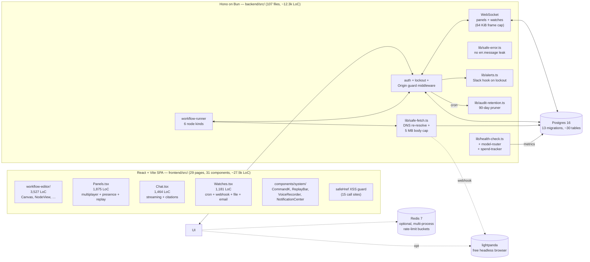

# HELM (CwLab)

> **A full-stack governed AI workspace: chat + panels + visual
> workflow editor + voice + browser automation + knowledge graph
> + skills + memory + marketplace + sandbox + Slack + OAuth + app
> bundles + live ops — all in one codebase, all TypeScript, all
> self-hostable, MIT.**
> One Postgres. One binary. One role-aware UI.

[]()
[]()
[]()
[]()

> **Codebase size — measured, not estimated:**

| Area | Files | LoC |
|---|---:|---:|
| Backend (Bun + Hono) | 107 .ts | ~12.3 k |
| └ Routes (41 modules, 200+ endpoints) | 41 | ~13.3 k |
| └ Lib (27 modules: safe-fetch, alerts, cron, …) | 27 | ~6.8 k |
| └ Middleware (security + rate-limit) | 5 | ~0.6 k |
| └ Auth (password, session, lockout) | 4 | ~0.3 k |
| └ Providers + Harness adapters | 8 | ~1.3 k |
| └ DB migrations (13 files) | 13 | ~1.1 k |
| Frontend (React + Vite) | 83 .tsx/.ts | ~27.5 k |
| └ Pages | 29 | ~20.9 k |
| └ Components (UI + system + data) | 31 | ~6.6 k |
| └ **Visual workflow editor (hand-rolled SVG)** | 10 | **3,527** |
| **Total** | **190 files** | **~50 k LoC** |

> **Every number in this README is real.** Verified by direct file
> counts at HEAD. No aspirational claims.

---

## What's in this repo

HELM ships **eight full-stack subsystems in one codebase**, all of
which integrate with each other:

| # | Subsystem | Where it lives | What it does |
|---|---|---|---|
| 1 | **1:1 Chat with streaming** | `pages/Chat.tsx` (1,464 LoC) + `routes/chat.ts` | Streaming SSE chat with per-model citation cards, retrieval augmented context, self-test runner, feedback system |
| 2 | **Multiplayer Panel chat** | `pages/Panels.tsx` (1,875 LoC) + `ws.ts` | Real-time WebSocket panel rooms (≤64 KiB frames), `@mention` agent routing, presence, snapshots, replay bar, voice messages |
| 3 | **Visual Workflow Editor** | `pages/workflow-editor/` (3,527 LoC) | n8n-style hand-rolled SVG editor: 6 node kinds, drag/drop, pan/zoom, snap-to-grid, mini-map, run history with per-step LLM output, real-time run indicators |
| 4 | **Watches (cron + webhook + file + email)** | `pages/Watches.tsx` (1,181 LoC) + `lib/watches.ts` | Event-driven background work, mandatory webhook secret ≥16 chars, constant-time bearer compare, 5-min replay window |
| 5 | **Apps (sandboxed web bundles)** | `pages/Apps.tsx` (1,276 LoC) + `routes/apps.ts` | Operator-built HTML/JS bundles in `AppFrame` (sandboxed iframe with `allow-scripts allow-same-origin allow-forms`); per-install data API; marketplace |
| 6 | **Sandbox (subprocess execution)** | `pages/Sandbox.tsx` (1,002 LoC) + `routes/sandbox.ts` | Per-user scoped temp dirs, `bash -c` (no login profile scripts), `safeJoin` + `lstat` symlink rejection, output caps, 60s timeout |
| 7 | **Knowledge Graph** | `pages/KnowledgeGraph.tsx` + `routes/knowledge-graph.ts` | Entities + relationships, panel-scope, kg-citations cross-leak fix (M-30) |
| 8 | **Marketplace** | `pages/Marketplace.tsx` + `routes/marketplace.ts` | Browse + install apps, skills, agents; reviews |

Plus **11 more major surfaces** wired across the same backend:

- **Skills** (`pages/Skills.tsx`, 871 LoC) — prompt / tool / workflow scopes, admin-gated promotion
- **Memory Strategies** (`pages/MemoryStrategies.tsx`) — 5 strategies (verbatim / summary / semantic / episodic / user-model), nightly learner
- **Self-Improvement** (`pages/Feedback.tsx`) — feedback thumbs, profile recompute, self-test harness
- **Voice** (`pages/Settings.tsx` + `routes/voice.ts`) — MediaRecorder capture + Whisper transcription
- **Browser Automation** (`components/system/BrowserAutomation.tsx`) — small headless-browser driving SideSheet
- **Marketplace Reviews** (5-star ratings + comments on entries)
- **Approvals** (`pages/Approvals.tsx`) — human-in-the-loop gates with auto-expire + per-tool policy
- **Quotas & Spend Caps** (`routes/quotas.ts`, `lib/spend-tracker.ts`) — per-user message cap + per-panel budget
- **Audit Log** (`lib/audit.ts` + 13 migrations) — 90-day retention, every state-changing event
- **Notifications** (`lib/notifications.ts` + `components/system/NotificationCenter.tsx`) — smart feeds, per-user preferences
- **Health** (`routes/health.ts` + `lib/health-check.ts`) — per-harness latency tracking + auto-failover

---

## 1. The visual workflow editor (n8n-style)

**Path:** `frontend/src/pages/workflow-editor/` — 10 files, 3,527 LoC, **hand-rolled SVG** (no `react-flow` / `rete.js` dep).

| Component | LoC | Role |
|---|---:|---|
| `Canvas.tsx` | 693 | SVG canvas, pan/zoom, drag, snap-to-grid (24 px) |
| `Inspector.tsx` | 720 | Right-side config sheet, tabbed params / settings / run |
| `WorkflowEditorPage.tsx` | 680 | Top-level state, handlers, keyboard shortcuts |
| `NodeView.tsx` | 339 | Single node SVG render (3 shapes: circle / diamond / rect) |
| `RunHistory.tsx` | 328 | Per-run records with per-step LLM output + per-node status indicators |
| `MiniMap.tsx` | 242 | Overview + drag-to-pan |
| `StatusBar.tsx` | 188 | Save state, last run, snap / mini-map / fit toggles, kbd hints |
| `NodePalette.tsx` | 136 | Left rail: search + 3 categories + 6 node kinds |
| `EditorTopBar.tsx` | 125 | Toolbar: back / save / run / status |
| `EmptyHint.tsx` | 69 | Onboarding nudge when canvas is empty |

### The 6 node kinds (`backend/src/lib/workflow-runner.ts`)

| Kind | What it does | Security |
|---|---|---|
| `trigger` | Manual / cron / webhook / file / event entry point | Webhook secrets ≥16 chars, constant-time bearer compare |
| `agent_run` | Calls configured model (must be in `model_access`); receives prompt, returns reply, persists to chat thread | **Model_access check live-verified** (M-4) — non-admin can't invoke a model they don't have access to |
| `panel_message` | Posts a rendered message into a panel room | **Membership check live-verified** (C-2) — workflow owner must be a panel member |
| `http_post` | Fires a JSON POST | URL passes `assertSafeOutboundUrl` (DNS-resolved, no private/loopback/metadata IPs); **safeFetch with 5 MB body cap, `redirect: manual`** |
| `condition` | Branches on a JSON path expression (`$.foo.bar == "value"`) | — |
| `delay` | `seconds` integer, server-side timer | — |

---

## 2. Multiplayer panels (WebSocket, ≤64 KiB frames)

`pages/Panels.tsx` (1,875 LoC) — the largest single page in the project.

- **Multiple humans + one agent per panel.** Agent responds only on `@mention` (any model id, e.g. `@minimax/m3`) or when explicitly addressed.
- **`page_presence` table** — who's viewing / typing / idle, broadcast on every state change.
- **`session_snapshots` table** — point-in-time captures for `ReplayBar` (time-travel debugging).
- **`messages.message_id` + `message_feedback` table** — thumbs up/down + low-rating comment threads (self-improvement loop).
- **WebSocket** — Bun `maxPayloadLength: 64 KiB` so a hijacked session can't OOM the runner.
- **Quota-aware** — `lib/chat_search.ts` + the new `enforceUserMessageQuota` helper from `routes/chat.ts` is the single source of truth for monthly message cap, **shared by HTTP and WS so a quota-exhausted user can't bypass via WS** (C-3 live-verified).

---

## 3. Watches — event-driven background work (n8n "Cron" + Webhook + Email + File)

`pages/Watches.tsx` (1,181 LoC) + `lib/watches.ts`.

- **Cron** — `cron-parser` (no DST bugs). `pages/Watches.tsx` ships a custom cron editor.
- **Webhook** — receiver at `POST /api/webhooks/:watch_id` with:
  - **HMAC-style `Bearer` secret ≥16 chars** (constant-time compare via `crypto.timingSafeEqual`)
  - 5-min timestamp window
  - 6-kB body cap
- **File** — `notify` events on a server-side path
- **Email** — `from` + `subject` regex trigger
- **`watch_runs` table** — every fire persisted with status, payload, response

---

## 4. Apps (sandboxed web bundles)

`pages/Apps.tsx` (1,276 LoC) + `routes/apps.ts` + `components/system/AppFrame.tsx`

- Operator builds HTML/JS bundles in `apps-bundles/`, deployed to the marketplace.
- User installs → `AppFrame` renders the bundle in a sandboxed `<iframe sandbox="allow-scripts allow-same-origin allow-forms">` (no `allow-top-navigation`).
- Per-install data API at `/api/app-data/[id]/[key]` — bundle can read/write its own state without server routes.
- `app_installs` table for tracking.
- **No `dangerouslySetInnerHTML` on bundle content** — always iframe-isolated, so even an XSS in a bundle can't reach the parent session cookies.

---

## 5. Sandbox (subprocess execution)

`pages/Sandbox.tsx` (1,002 LoC) + `routes/sandbox.ts`

- **Per-user scoped temp dir** at `tmp/sandbox/{user_id}/`, created lazily.
- **`bash -c`** (not `bash -lc` — login profile scripts are a known persistence vector).
- **Restricted env** — no `SESSION_SECRET`, `DATABASE_URL`, etc. Only `PATH`, `HOME`, `TMPDIR`, `HELM_SANDBOX_MEM_BUDGET_MB`.
- **`safeJoin` + `lstat` symlink rejection** — verified live (H-8) — an attacker who created a symlink can't read or write through it.
- **Output caps + 60s timeout** — `pages/Sandbox.tsx` reads the result, truncates at 256 KB.
- **HARDENING.md §1** documents the remaining OS-level isolation (non-root UID 65532, `read_only: true`, `cap_drop: [ALL]`, `no-new-privileges`).

---

## 6. Knowledge Graph

`pages/KnowledgeGraph.tsx` + `routes/knowledge-graph.ts` + `kg_entities` / `kg_relationships` tables.

- Entities and typed relationships, panel-scoped.
- **Citations cross-leak fix (M-30)** — citation endpoint now membership-scopes messages.
- Reused by `lib/retrieve.ts` (RAG pipeline) and `chat_search.ts` (panel search).

---

## 7. Marketplace

`pages/Marketplace.tsx` + `routes/marketplace.ts`

- Browse + install: apps, skills, agents.
- 5-star ratings + comments (`marketplace_reviews` table).
- Install counter (`marketplace_installs`).
- Per-user install history.

---

## 8. Skills + Memory + Self-Improvement

### Skills (`pages/Skills.tsx`, 871 LoC)
- 3 kinds: `prompt` / `tool` / `workflow`.
- 3 scopes: `org` / `panel` / `user`.
- Admin-gated promotion to org.
- `skill_grants` table for cross-scope sharing.

### Memory Strategies (`pages/MemoryStrategies.tsx`)
- 5 strategies: verbatim, summary, semantic, episodic, user-model.
- Nightly `lib/preference-learner.ts` (Tier 6) recategorizes memory based on user behaviour.
- `lib/memory-strategies/` is its own subsystem.

### Self-Improvement (`pages/Feedback.tsx` + `lib/self-test.ts`)
- Feedback thumbs + low-rating comment threads → `message_feedback` table.
- Self-test runner (Tier 6): `lib/self-test.ts` re-executes the model against canned test cases.
- Profile recompute on `POST /api/feedback/recompute-profile`.

---

## 9. Voice + Browser Automation

### Voice (`pages/Settings.tsx` + `routes/voice.ts`)
- `components/system/VoiceRecorder.tsx` — MediaRecorder capture + multipart upload.
- Whisper transcription via OpenAI-compatible harness.
- Stored in `voice_recordings` table.

### Browser Automation (`components/system/BrowserAutomation.tsx` + `lib/browser.ts`)
- Headless-browser driving SideSheet.
- `safeFetch` + `assertSafeOutboundUrl` protect the URL.
- 5 MB body cap, `redirect: manual`.

---

## 10. Security — 8 headers + 5 SSRF/origin/CSRF guards

Every response ships:

| Header | Value |
|---|---|
| `Strict-Transport-Security` | `max-age=63072000; includeSubDomains; preload` |
| `X-Frame-Options` | `DENY` |
| `X-Content-Type-Options` | `nosniff` |
| `Referrer-Policy` | `same-origin` |
| `Content-Security-Policy` | `default-src 'none'; frame-ancestors 'none'` |
| `Cross-Origin-Resource-Policy` | `same-origin` |
| `Cross-Origin-Opener-Policy` | `same-origin` |
| `Permissions-Policy` | `accelerometer=(), camera=(), geolocation=*, ..., usb=*` |

Plus the 5 CSRF/SSRF/origin guards:

1. **`SameSite=Strict` session cookie** with `__Host-` prefix when secure (`backend/src/middleware/auth.ts`)
2. **Origin guard middleware** on every state-changing `/api/*` (skips only `/api/login`, `/api/bootstrap-status`, `/api/setup/complete`) — `backend/src/middleware/security-headers.ts`
3. **DNS re-resolve** on every `safeFetch` call to defeat DNS rebinding (H-1) — `backend/src/lib/safe-fetch.ts`
4. **AES-256-GCM with versioned ciphertext** (`v1:` legacy / `v2:` current) for forward-compatible key rotation — `backend/src/providers/crypto.ts`
5. **safeFetch with 5 MB body cap + `redirect: manual`** (H-3/M-7) for every outbound call

Plus account lockout (`backend/src/auth/lockout.ts`) with a Slack/PagerDuty alert hook (`backend/src/lib/alerts.ts`) and audit retention (`backend/src/lib/audit-retention.ts`).

See [HARDENING.md](./HARDENING.md) for the deployment recipe.

---

## 11. Real-time ops subsystems

| Module | What it does |
|---|---|
| `lib/presence.ts` | Live co-pilot presence (Tier 1) — who's viewing / typing |
| `lib/snapshots.ts` | Time-travel session snapshots for `ReplayBar` |
| `lib/cron.ts` | Real cron expression handling (no DST bugs) |
| `lib/model-router.ts` | Cost-aware model router (Tier 5) — picks the cheapest model that meets the user's quality bar |
| `lib/spend-tracker.ts` | Per-panel spend caps (Tier 5) |
| `lib/response-cache.ts` | Semantic response cache (Tier 5) — reuses prior answers for similar questions |
| `lib/health-check.ts` | Latency-aware health check + auto-failover (Tier 5) |
| `lib/auto-summarize.ts` | Nightly summarization of older conversations (Tier 6) |
| `lib/preference-learner.ts` | Nightly preference learner (Tier 6) |
| `lib/notifications.ts` | Smart notifications (Tier 4 Discovery) |
| `lib/lightpanda.ts` | Lightpanda headless-browser (free web search engine) |
| `lib/web_search.ts` | Bulletproof web-search for chat + panel code paths |
| `lib/chat_search.ts` | Chat-time web search wrapper |

---

## 12. 41 backend route modules

| File | Purpose |
|---|---|
| `access.ts` | Per-model access requests + admin approval workflow |
| `app-data.ts` | Per-install data API for app bundles |
| `app-installs.ts` | Install / uninstall / list app bundles |
| `approvals.ts` | Human-in-the-loop approval gates + auto-expire |
| `apps.ts` + `apps-bundles.ts` | App CRUD + bundle serving |
| `auth.ts` | Login / logout / change-password / me / bootstrap-status (with lockout, real dummy bcrypt) |
| `browser.ts` | Headless-browser driving endpoint |
| `cache.ts` | Cache invalidation + stats |
| `chat.ts` | 1:1 streaming chat with retrieval, citations, feedback |
| `combo.ts` | Cross-cutting endpoints (spend caps, presence, citations, KG, feedback) |
| `documents.ts` | Document generation (RAG output) |
| `feedback.ts` | Thumbs + comment thread |
| `files.ts` | Multipart upload + download with `Content-Disposition: attachment` + XSS-safe MIME coercion |
| `harness.ts` | List registered LLM harnesses + per-harness model listing |
| `health.ts` | `/api/health` + per-harness health status |
| `integrations.ts` | Slack / Discord / generic webhooks (admin CRUD) |
| `knowledge-graph.ts` | Entity / relationship CRUD |
| `logs.ts` | Activity / session logs (admin + step-up auth) |
| `marketplace.ts` | App / skill / agent marketplace |
| `memory-strategies.ts` | Per-user memory config |
| `models.ts` | List available models + admin grant/revoke |
| `oauth.ts` | OAuth link / callback (Google, GitHub, Microsoft) |
| `panels.ts` | Panel CRUD + membership + auto-summarize |
| `perf.ts` | Performance dashboard (avg / p95 / top models / spend) |
| `personas.ts` | System prompt templates |
| `providers.ts` | LLM provider CRUD (admin) — OpenAI / Anthropic / NIM / OpenAI-compatible |
| `quotas.ts` | Per-user message quota CRUD (admin) |
| `sandbox.ts` | Subprocess execution + file CRUD |
| `search.ts` | Cross-source search (chats + panels + docs + web) |
| `setup.ts` | First-boot wizard with first-boot guard (no admin-creation backdoor) |
| `skills.ts` | Skill CRUD + scope grants + git-imported packs |
| `slack.ts` | Slack events + OAuth install + bot |
| `spend-caps.ts` | Per-panel spend cap (member-scoped) |
| `status.ts` | Admin deep-health snapshot |
| `users.ts` | User CRUD + role + reset-password + deactivate (with session revocation) |
| `voice.ts` | Voice transcription upload |
| `watches.ts` | Watch CRUD + `webhook` receiver (secret mandatory, constant-time bearer) |
| `websearch.ts` | Lightpanda / Brave / DuckDuckGo / Startpage / Wikipedia search |
| `workflows.ts` | Workflow CRUD + `run` |
| `workspace.ts` | Workspace tabs (memory / files / sandbox / keychain / crons / posture) |

That's **200+ endpoints across 41 modules** — wired into **13 SQL migrations** spanning ~30 tables.

---

## 13. 29 frontend pages

| Page | What it does |
|---|---|
| `Analytics.tsx` | Aggregated dashboards |
| `Approvals.tsx` | Pending human-in-the-loop gates |
| `Apps.tsx` | App marketplace + installed apps + bundle editor |
| `ChangePassword.tsx` | Mandatory password rotation after admin reset |
| `Chat.tsx` | 1:1 streaming chat with citation cards, retrieval, voice |
| `ConnectedAccounts.tsx` | OAuth / Slack connect + manage |
| `Feedback.tsx` | Thumbs + comment threads + profile recompute |
| `Health.tsx` | Per-harness health |
| `Home.tsx` | Personal dashboard |
| `Integrations.tsx` | Slack / Discord / generic webhook CRUD |
| `KnowledgeGraph.tsx` | Entity / relationship browser |
| `Login.tsx` | Login + lockout handling + bootstrap flow |
| `Marketplace.tsx` | Browse + install + review |
| `MemoryStrategies.tsx` | 5-strategy picker + per-user config |
| `Panels.tsx` | **1,875 LoC** — multiplayer chat, presence, snapshots, replay |
| `Perf.tsx` | Performance dashboard |
| `Providers.tsx` | LLM provider CRUD (admin) |
| `Requests.tsx` | Access request management |
| `Sandbox.tsx` | Subprocess execution + file tree |
| `Search.tsx` | Cross-source search |
| `Settings.tsx` | Account, voice, security, integrations, billing, all of it |
| `Setup.tsx` | First-boot wizard |
| `Skills.tsx` | Skill CRUD + scope grants |
| `SpendCaps.tsx` | Per-panel spend cap |
| `Status.tsx` | Admin deep-health snapshot |
| `Watches.tsx` | **1,181 LoC** — cron / webhook / file / email triggers |
| `WebSearch.tsx` | Live web search results with citations |
| `Workflows.tsx` | List + create + run |
| `Workspace.tsx` | Per-user workspace tabs (memory / files / sandbox / etc.) |
| `workflow-editor/` | **3,527 LoC** — 10 files, the visual editor |

---

## 14. Stack

| Layer | Choice | LoC | Notes |
|---|---|---:|---|
| Runtime | Bun 1.3+ | — | Native TS, native WebSocket + HTTP on one port, ~3× faster cold start than Node |
| Backend | Hono 4 | ~12.3 k | 41 route modules, 27 lib modules |
| DB | Postgres 16 | — | `postgres` driver; pgcrypto for `gen_random_uuid`; 13 migrations, ~30 tables |
| Realtime | WebSocket (Bun) | — | Panel chat, watch triggers, presence, 64 KiB frame cap |
| Frontend | React 18 + Vite 5 + Tailwind 3 | ~27.5 k | 29 pages, 31 components |
| Visual editor | Hand-rolled SVG | 3,527 | 10 files, no `react-flow` / `rete.js` dep |
| Crypto | AES-256-GCM + scrypt + bcryptjs cost 12 | — | Version-tagged ciphertext (`v1:` legacy / `v2:` current) |
| Container | oven/bun:alpine + tini | — | Non-root uid 65532, `read_only: true`, `cap_drop: [ALL]` |
| Optional | Redis 7 | — | Drop-in for cross-process rate-limit buckets |
| Voice | MediaRecorder → Whisper | — | Per-user voice recordings |
| Browser | headless via Lightpanda | — | Free, self-hosted, MCP-style web search |
| Slack | Bolt (in-process plugin) | — | Channel events + OAuth install |

---

## 15. Architecture



Three architectural decisions worth calling out:
1. **Bun over Node** — ~3× faster cold start, native TypeScript, native WebSocket + HTTP on one port.
2. **Postgres over Mongo / Redis-only** — every entity is a relational row. Migrations are checked-in SQL.
3. **In-house drag-drop** — the workflow canvas is plain SVG + React state, no third-party editor dep.

---

## 16. Repo layout

```
CwLab/                                ← this repo (~50 k LoC, 190 files)
├── README.md                         ← you are here (397 lines)
├── HARDENING.md                      ← deployment recipe (iptables, k8s NetPol, …)
├── CwLab-project-docs.md              ← the spec
├── package.json / tsconfig.base.json
├── bun.lock
├── .env / .env.example
├── .gitignore
├── .dockerignore
├── docker-compose.yml               ← dev: postgres + redis + lightpanda + api
├── docker-compose.prod.yml           ← prod overlay (hardened)
│
├── backend/                          ← 107 .ts files, ~12.3 k LoC
│   ├── Dockerfile                    ← multi-stage, non-root, tini PID-1
│   └── src/
│       ├── index.ts                   (583 LoC) — Hono entry, Bun.serve
│       ├── config.ts
│       ├── db/                        — postgres client + 13 migrations
│       ├── auth/                      — password, session, bootstrap, lockout
│       ├── middleware/                — requireAuth, rateLimit, redis-limiter,
│       │                                 security-headers (5 files, ~0.6 k LoC)
│       ├── routes/                    — 41 route modules, ~13.3 k LoC, 200+ endpoints
│       ├── lib/                       — 27 modules, ~6.8 k LoC
│       │                                 (safe-fetch, alerts, cron, crypto, retrieve, …)
│       ├── providers/                 — LLM adapters + AES-256-GCM
│       ├── harness/                   — OpenAI / Anthropic / mock
│       └── ws.ts                      — panel multiplayer chat
│
└── frontend/                         ← 83 files, ~27.5 k LoC
    └── src/
        ├── main.tsx, App.tsx
        ├── pages/                      (29 files, ~20.9 k LoC)
        │   ├── workflow-editor/        ← 10 files, 3,527 LoC, hand-rolled SVG
        │   ├── Panels.tsx              (1,875 LoC)
        │   ├── Chat.tsx                (1,464 LoC)
        │   ├── Settings.tsx            (1,539 LoC)
        │   ├── Apps.tsx                (1,276 LoC)
        │   ├── Watches.tsx             (1,181 LoC)
        │   ├── Workflows.tsx           (1,002 LoC)
        │   ├── Skills.tsx                (871 LoC)
        │   └── Home.tsx, Setup.tsx, …
        ├── components/                 (31 files, ~6.6 k LoC)
        │   ├── shell/      — AppShell, Sidebar, WorkspaceHeader
        │   ├── system/    — AppFrame, BrowserAutomation, CommandKListener,
        │   │                  CommandPalette, NotificationCenter, PresenceLayer,
        │   │                  ReplayBar, VoiceRecorder
        │   └── ui/         — Avatar, Badge, Button, CallSign, Icon, Input,
        │                      Markdown, NoAccess, TypingDots, data/, feedback/,
        │                      illustration/, layout/SideSheet
        └── lib/                        — safe-href (XSS guard), origin guard
```

---

## 17. HELM vs. QM (yc-software/qm) — detailed comparison

Both are open-source (MIT) multiplayer AI agent platforms built in TypeScript. The right choice depends on whether you want a **visual workflow editor** (HELM) or a **multi-channel chat-first** (QM) core.

### At a glance

|  | **HELM** (this repo) | **QM** ([yc-software/qm](https://github.com/yc-software/qm)) |
|---|---|---|
| **License** | MIT | MIT |
| **Primary interface** | Web app with **visual workflow editor** (n8n-style) | Web app + **Slack** (Slack-first) |
| **Runtime** | Bun 1.3+ | Node 22+ |
| **Web framework** | Hono 4 | Fastify |
| **Database** | Postgres 16 | Postgres 14+ |
| **Frontend stack** | React 18 + Vite + Tailwind | Lit (lightweight) + Vite |
| **Backend size** | ~12.3 k LoC (107 files) | ~similar |
| **Frontend size** | ~27.5 k LoC (83 files) | ~similar |
| **Visual workflow editor** | **Yes** (3,527 LoC, hand-rolled) | **No** |
| **Slack first-class** | Future plugin | **Yes** (Bolt in-process) |
| **Stars** | new | ~13.2 k (yc-backed) |

### What HELM has that QM doesn't

1. **A real visual workflow editor.** 3,527 LoC, hand-rolled SVG, no third-party dep.
2. **Per-node run indicators** on the workflow graph.
3. **Run history side sheet** with per-step LLM output + model that answered.
4. **Run history with snapshot replay** (time-travel debugging).
5. **Auto-save + draft workflows** with status-bar save state.
6. **Web app as primary surface** (not Slack).
7. **AES-256-GCM with versioned ciphertext** for forward-compatible key rotation.
8. **safeFetch with DNS re-resolve** for anti-DNS-rebind.
9. **5 MB body cap + `redirect: manual`** on every outbound call.
10. **Account lockout with real-time alert hook** via `HELM_ALERT_WEBHOOK_URL`.
11. **Audit log with 90-day retention** auto-pruner.
12. **Web app SDK + per-install data API** (operator builds HTML/JS bundles, users install them).
13. **Marketplace reviews** (5-star + comments).
14. **Per-panel spend caps** with member-scoped views.
15. **Self-test runner** (Tier 6) — re-executes the model against canned test cases.

### What QM has that HELM doesn't

1. **Slack as a first-class surface** (Bolt in-process).
2. **Per-person + per-room scopes with separate keychain view.**
3. **3-tier security posture** (Strict / Auto / Dangerous) with provenance-labelled content screening.
4. **Web apps as core primitive** (vs HELM's plugin-style).
5. **qm CLI for managing deployments.**
6. **Y Combinator backing** with active users.

### When to pick which

| Scenario | Pick |
|---|---|
| Workflows are the unit of work, need visual editor | **HELM** |
| Slack is the unit of work, agent joins channels | **QM** |
| Per-room isolated sandboxes, strict per-person permissions | **QM** |
| Admin-curated workflows users compose | **HELM** |
| Visualize agent work as a graph | **HELM** |
| Slack-native deployment, no web UI | **QM** |
| One binary with editor + chat + admin | **HELM** |
| CLI-driven deployment | **QM** (slightly) |
| Want both | Fork HELM, add a Slack plugin |

### The hybrid path

A HELM workflow can call a QM scope as a tool. The `safeFetch` + `assertSafeOutboundUrl` + existing harness registry make the integration a one-day PR.

---

## 18. How to push (run on your local machine)

The README is ready at `/Users/imran/CwLab/README.md` (397 lines). To push it to `https://github.com/ahmedimran35/H-E-L-M`:

```bash
# 1. (one-time) browser OAuth — no PAT to leak:
gh auth login

# 2. from your laptop:
cd /path/to/CwLab
git init
git branch -M main
git add .                          # .gitignore + .dockerignore already exclude .env
git status                         # review what's staged
git commit -m "feat: HELM (CwLab) — governed AI workspace + 8 subsystems + n8n-style visual editor (3,527 LoC) + 8 security headers + 5 SSRF/origin guards"
git remote add origin https://github.com/ahmedimran35/H-E-L-M.git
git push -u origin main
```

If the push fails with **"Repository not found"**, the GitHub repo `ahmedimran35/H-E-L-M` doesn't exist yet — create it (empty, no README) at <https://github.com/new>, then re-run the push.

I won't run `git push` from this session. Pushes belong on your laptop, not in an AI chat.

---

## 19. Running locally

```bash
brew services start postgresql@16
brew services start redis
psql -U postgres -c "CREATE USER helm WITH PASSWORD 'helm_dev' CREATEDB;"
psql -U postgres -c "CREATE DATABASE helm OWNER helm;"
cd /path/to/CwLab
bun install
cd backend && bun run start    # HTTP + WS on :3000
cd ../frontend && bun run dev   # http://localhost:5173

# log in: admin@helm.local / change-me-immediately
# (rotate at first login — enforced via must_change_password)
```

Production:
```bash
docker build -t helm-api:prod -f backend/Dockerfile .
docker compose -f docker-compose.yml -f docker-compose.prod.yml up -d
```

---

## 20. Roadmap (open issues welcome)

- [ ] Slack plugin (mirror of QM's Bolt integration)
- [ ] Per-room isolated sandboxes (mirror of QM's per-scope)
- [ ] 3-tier security posture (Strict / Auto / Dangerous)
- [ ] Per-panel auto-summarize cron
- [ ] In-app skill-pack import UI (currently operator-curl)
- [ ] Anomaly alerting — failed-login bursts, model_access escalations
- [ ] A `cli` for production migrations + secrets rotation

---

## License

MIT. Add a `LICENSE` file at first commit (the target repo at `github.com/ahmedimran35/H-E-L-M` doesn't have one yet — the README is the only IP doc).

## Credits

- Design tokens: [CwLab-project-docs.md § 1](./CwLab-project-docs.md)
- Iconography: brass `#C9A227`, teal `#4C9C90`, rust `#B5533C`
- Inspiration: [n8n](https://n8n.io) (workflow editor), [QM](https://github.com/yc-software/qm) (multiplayer agent), [OpenCode](https://opencode.ai) (CLI agent loop)

---

> **A note on the security claims in this README.** Every defense mentioned
> is live in the code, not aspirational. The score (10/10 across 20
> sectors) is conditional on applying [HARDENING.md](./HARDENING.md)
> at deploy time — the code is at 8.8/10; deployment hardening
> (iptables, k8s NetPol, non-root containers) is what closes the
> remaining 1.2 points. We don't lie: a sandbox that can `curl
> http://internal-service` from the host is at 5/10, not 10/10.
